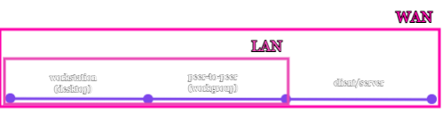
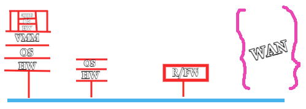
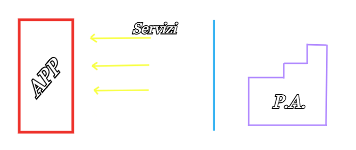
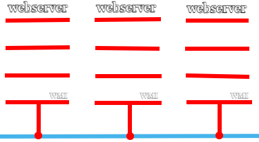

# LAB

---

## 2021-09-20

---

## 2021-09-17

### VM: Configurazione di rete

- **NAT**\
    -> **DHCP**: virtualizzatore\
    -> tutte le macchine hanno lo stesso indirizzo IP di classe A (10.x.x.x)

- **NAT Network**\
    -> **DHCP**: virtualizzatore\
    -> le macchine hanno indirizzi IP diversi, poichè le VM fanno parte della stessa rete

- **Bridge**\
    -> **DHCP**: si delega, in base al contesto _(indirizzi IP statici/assegnati dal DHCP del router)_\
    -> non si fa differenza tra VM e macchine fisiche\
    -> **DISCRIMINANTE** -> classe degli indirizzi IP

#### Glossary

- **Microservizi**
    - è un tipo di struttura architetturale che permette la rapida, frequente e affidabile distribuzione di applicazioni grandi e complesse, inoltre permette all'organizzazione di evolversi nel suo stack
    - questo tipo di architettura definisce un'app come un insieme di servizi che sono:
        - altamente mantenibili e testabili
        - liberamente accoppiati
        - distribuibili indipendentemente
        - organizzati intorno alle funzionalità dell'azienda

- **Container**
    - VM specializzata che ospita un microservizio
    - unità standard di software che impacchetta il codice e tutte le dipendenze, per far funzionare velocemente e affidabilmente l'applicazione da un ambiente all'altro.
    - l'immagine di un container Docker è un pacchetto leggero, autonomo ed eseguibile del software che include tutto il necessario per eseguire un'applicazione: codice, runtime, system tools, system libraries e impostazioni.

- **Orchestratore**
    - strumenti per amministrare, scalare, e mantenere applicazioni containerizzate
    - es.: Kubernetes, Docker Swarm 

- **LDAP** [Lightweight Directory Acces Protocol]
     - protocollo standard per l'interrogazione e la modifica dei *servizi di directory* (un qualsiasi raggruppamento di informazioni che può essere espresso come record di dati e organizzato in modo gerarchico)

- **Protocollo**
    - insieme di regole convenzionali che disciplinano il funzionamento di un sistema di comunicazione
    - permette di accedere ai servizi

- **BC/DR** [Business Continuity/Disaster Recovery]
    - pratica che serve per prepararci a minimizzare gli effetti di eventi che vanno ad intaccare il servizio significativamente
    - suddiviso in due parti:
        - *Business Continuity* -> concentrato sulla parte di operazioni aziendali, coinvolge la progettazione e la creazione di policies e procedure, che assicurino il funzionamento delle procedure essenziali, durante e dopo il disastro
        - *Disaster Recovery* -> concentrato sulla parte tecnica, definisce come il dipartimento di IT di un'organizzazione recupererà da un disatro naturale/artificiale 

- **Appliance**
    - termine generico che racchiude molti aspetti dei sistemi integrati e delle soluzioni correlate che attraversano data center, PC e distribuzione di software
    - può avere molti significati e interpretazioni da parte del settore, dei fornitori con relative iniziative di mercato e derivati
    - sono più di semplici pacchetti IT con il marketing: offrono tecnologia congiunta, hardware, gestione software e servizi.

- **check update**
    - port 8530
    - cerca il servizio **WSUS**
    - porta WSUS in un servizio interno
    - si collega con il WSUS in cloud e scarica l'update su quello "locale"
    - le macchine fanno l'update appoggiandosi al WSUS sulla rete locale

---

## 2021-09-15

*P.A.* -> procedura aziendale

---

### IO [applicazione opensource]
**keywords:** identità, sicurezza, LDAP, GDPR

Offre servizi dello Stato/Provincia/Comune -> es.: Green Pass, Cashback, etc.

---

### workstation -> peer-to-peer -> client/server

**Server:**
- SW
    - DB
    - web
    - print
    - ***file*** -> tra i protocolli di comunicazione utilizza il protocollo SMB (Server Message Block), che è causa di buchi nella sicurezza

---

### AD
Active Directory

- Sistema server centralizzato, cuore di Windows Server, che si fonda sui concetti di dominio (in particolare di un Dominio Windows Server) e di directory, ovvero un insieme di directory services (servizi di rete), gestiti da un domain controller e adottati dai sistemi operativi Microsoft a partire da Windows 2000 Server

- Definisce la modalità con cui vengono assegnate agli utenti tutte le risorse di rete, secondo l'assegnazione da parte dell'amministratore di sistema di Group Policy

-  LDAP viene usato come database in cui vengono memorizzate in forma centralizzata tutte le informazioni di un dominio di rete, relativamente ad autenticazioni ed accesso ai servizi, mantenendo tutte queste informazioni sincronizzate tra i vari server

### VDI
Virtual Desktop Infrastructure

Infrastruttura per la virtualizzazione dei client

 - hosting di un ambiente desktop su un server centralizzato
 - forma di virtualizzazione desktop, in quanto l'immagine specifica gira su VMs e viene inviata al client attraverso una rete

---

| OS        | Multitask                    | Multiuser                    |
|-----------|------------------------------|------------------------------|
| DOS       |   <ul><li>- [ ] </li></ul>   |   <ul><li>- [ ] </li></ul>   |
| Windows   |   <ul><li>- [x] </li></ul>   |   <ul><li>- [ ] </li></ul>   |
| GNU/Linux |   <ul><li>- [x] </li></ul>   |   <ul><li>- [x] </li></ul>   |

**Multitask** -> più processi in exec contemporaneamente
**Multiuser** -> più utenti collegati contemporaneamente

---

## 2021-09-13

**GPI** -> Gestione Progetto, Organizzazione di Impresa

**Progetto**
- ha un inizio e una fine
- vanno identificati gli *stakeholeder*
- ***R&D*** -> Research & Development (progetti che potrebbero non arrivare ad una conclusione)

---

### *Business Model Canvas*

***KPI*** -> Key Performance Indicators, determinano la qualità

---

### Principio di Pareto | 80% 20%
**keywords:** semplificare, razionalizzare, ridimensionare, focalizzare

Il *principio di Pareto* afferma che il 20% delle cause provoca l'80% degli effetti; è un punto di riferimento utile per pianificare, analizzare e risolvere i problemi e raggiungere gli obiettivi.

Si può applicare in qualsiasi ambito.
**Esempi:**
| 80%             | 20%          |
|-----------------|--------------|
| Progetto finito | Manutenzione |
| Pensare         | Programmare  |

---

### *Scan-Plan-Do-Check-Act Cycle*
[processo di miglioramento continuo]

***Scan*** -> Identify the problem\
***Plan*** -> Recognize an opportunity and plan a change\
***Do*** -> Test the change\
***Check*** -> Review the result, analize it and identify what you've learned\
***Act*** -> Take action based on what you've learned

---

### *ITIL*
Information Technology Infrastructure Library

Si basa sul **CMDB** (Content Management DataBase), è un insieme di pratiche dettagliate, per attività di IT, che si concentrano sull'allineamento con i bisogni del business.
